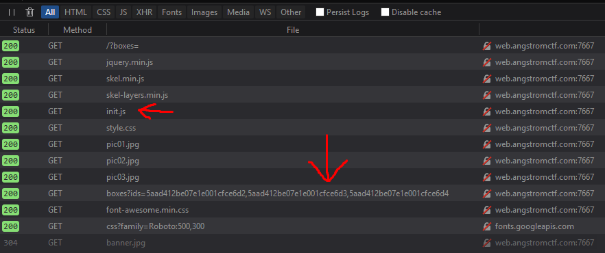
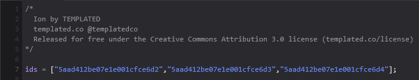
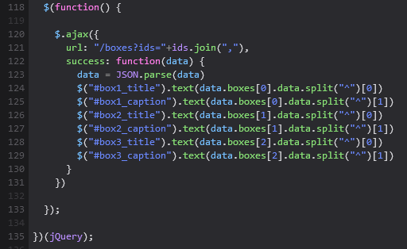
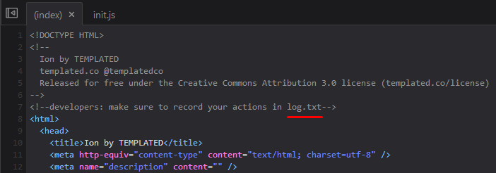
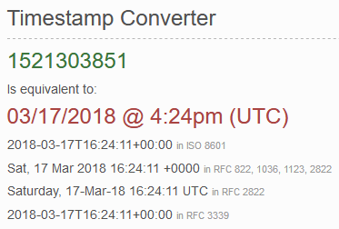

# The Best Website
Web - 230 Points - 96 Solves

> I have created what I believe to be the [best website ever](). Or maybe it's just really boring. I don't know.

<details>
  <summary> <b>Hint</b> </summary>
  <p>

  > My database is humongous!
  </p>
</details>

## Solution
This challenge was by far my favorite challenge out of all the challenges on AngstromCTF 2018. Let's take a look at it, shall we?


Upon visiting the website, we can see that it's filled with a bunch of random buttons and messages that don't really mean anything. The site uses a [TEMPLATED](https://TEMPLATED.co) template, which is cool and all, but doesn't really help us figure out anything much.

Let's dig deeper...

If you happen to visit the Network profiling tab while on the website, you might notice a few things worthy of your time:



There's two things to take note of here:
- The website loads an `init.js` script
- The website also submits a GET request with 3 weird looking IDs to the `/boxes` endpoint

Let's look at `init.js` first.




It looks like the script is taking 3 hex strings from the hardcoded variable `ids`, and sending them as a GET request to the endpoint `/boxes?ids=`. Then, it takes the response values and places them into the boxes on the website. (Note that we saw the request in the Network tab!)

But, what exactly are these ids?

If you haven't peeked at the hint yet, it mentions the presence of a database on the server. More specifically, MongoDB: "huMONGOus"

And, if you poked around the website source, you might have found this entry at the beginning:



Visiting http://web.angstromctf.com:7667/log.txt brings us the following data:

```
Sat Aug 10 2017 10:23:17 GMT-0400 (EDT) - Initial website
Sat Aug 10 2017 14:54:07 GMT-0400 (EDT) - Database integration
Sat Aug 11 2017 14:08:54 GMT-0400 (EDT) - Make some changes to the text
Sat Mar 17 2018 16:24:17 GMT+0000 (UTC) - Add super secret flag to database
```

Oh boy! The flag's in the database! Now, we just need to figure out how to fetch the flag from the database...

At this point, we can assume that the IDs involved in the GET request are actually MongoDB [ObjectIds](https://docs.mongodb.com/manual/reference/method/ObjectId/). Fortunately for us, MongoDB's ObjectId aren't completely random; they follow a certain structure. According to the docs, the structure of a MongoDB ObjectId is as follows:
- They are 12 byte hex strings
- The first 4 bytes represent the seconds since the Unix epoch, or the [UNIX Timestamp](https://www.unixtimestamp.com/)
- The next 3 bytes represent a unique machine identifier
- The next 2 bytes represent the process id
- The last 3 bytes represent a counter that starts with a random value

If we take a look at the last ID from the `init.js` file, we can see that it follows the structure perfectly!

```
VAL: "5aad412be07e1e001cfce6d4"
HEX: [5A AD 41 2B] [E0 7E 1E] [00 1C] [FC E6 D4]
DEC: [1521303851 ] [14712350] [28   ] [16574164]
```

If we plug the first decimal value into a [UNIX Timestamp Converter](https://www.unixtimestamp.com/), we get the following:



...which was roughly when the CTF started! (Technical issues delayed the start towards the next day)

Now that we've confirmed that the IDs are MongoDB ObjectIds, we can construct an ID that can help ui fetch us the flag.
- The first 4 bytes will have to be changed to match the entry in the `log.txt` that tells us when the flag added to the DB.
- We don't have to worry about changing the next 5 bytes, since the Machine ID and Process ID are most likely the same.
- Because the last 3 bytes originate from a counter that starts at a certain random value, we simply need to increment the previous value by 1! (Assuming that no other entries have been added between the boxes and the flag.)

Here's the process of doing so:

```
PREVIOUS VALUE:
VAL: "5aad412be07e1e001cfce6d4"
HEX: [5A AD 41 2B] [E0 7E 1E] [00 1C] [FC E6 D4]
DEC: [1521303851 ] [14712350] [28   ] [16574164]

Sat Mar 17 2018 16:24:17 GMT+0000 (UTC) --> (UNIX Timestamp) --> 1521303857
16574164 + 1 = 16574165

DEC: [1521303857 ] [14712350] [28   ] [16574165]
HEX: [5A AD 41 31] [E0 7E 1E] [00 1C] [FC E6 D5]
VAL: "5aad4131e07e1e001cfce6d5"
URL: http://web.angstromctf.com:7667/boxes?ids=5aad4131e07e1e001cfce6d5,filler,filler
```

And if we send it to the website, we get the response:
```
{"boxes":[{"_id":"5aad4131e07e1e001cfce6d5","data":"actf{0bj3ct_ids_ar3nt_s3cr3ts}","__v":0},null,null]}
```

## Flag
```
actf{0bj3ct_ids_ar3nt_s3cr3ts}
```

## Closing
Thanks for reading! If you notice any errors, or if you have any suggestions, please feel free to submit a GitHub issue and / or a PR to the repo. Happy hacking!

## More Write-ups
- http://slenderestman.com/8.html
- https://www.pwndiary.com/write-ups/angstrom-ctf-2018-the-best-website-write-up-web230/

